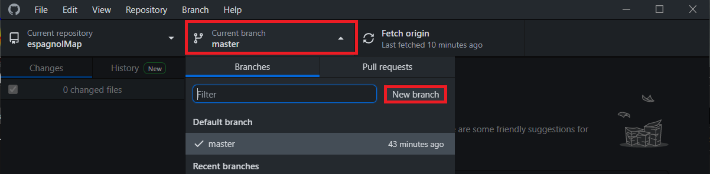

# Anleitung
In folgender Anleitung wird beschrieben wie Informationen zu der Karte hinzugefügt werden können.

## Dateiaufbau

Im `Data` Ordner befinden sich alle Dateien welche den Inhalt der Webseite beeinflussen.
- Im Ordner `Flag` sind die Länderflaggen im `jpg`-Format abgespeichert. Dort werden auch nur `jpg`-Dateien akzeptiert.
- Der Ordner `dialectAudio` beinhaltet Audio-Dateien für die einzelnen Länder.
- Im Ordner `Image` werden Bilder abgespeichert, die später in der Detail-Ansicht der einzelnen Länder zusehen sind. 

  Diese sollten am besten den Namen des Landes im Titel haben. Z.b.: `Argentinien01.jpg` 
   Bilder sollten wenn immer möglich im `jpg`-Dateiformat abgespeichert werden.

> ``📋`` Bilder sollten wenn möglich im `jpg` Dateiformat abgespeichert werden. Bilder welche die Dateiendung `JPG` haben sollten in `jpg` umbenannt werden.

In `data.json` werden weitere Informationen zu den Ländern abgespeichert.

## `data.json`

Die `data.json` Datei ist nach folgendem Schema aufgebaut, Beispiel Argentinien:

```json

"ARG": { // Länderkennung

    "fillKey": "primary", // oder secondary
    "Name": "Argentina", // Anzeigename
    "Country_flag": "Flaggen Datei aus flag folder", // Argentinien.jpg
    "languages": "",
    "culture": "",
    "Audio": [
      [
        "Titel (optional)" // wenn kein Titel ewünscht -> ""
        "AudioFile.mp3"
      ],
      //...
    ],
    "Video": [
      [
        "Video Titel",
        "https://youtu.be/57waq1HdllQ"
      ],
      [
        "Video Titel",
        "Argentinien01.mp4"
      ],
      //...
    ],
    "Image": [
      "Argentinien01.jpg",
      //...
    ],
    "Description": "",
    "Famous_people": ""
  },
  
``` 

Wenn neue Kategorien hinzugefügt werden sollen, muss die Implementierung [hier](https://github.com/Mozartuss/espagnolMap/blob/abf8d3ff1302502c7410f49095b7336471acc05e/index.html#L162) geändert werden. 

## Bearbeitung

Um Dateien zu editieren und z.B.: neue Bilder hinzuzufügen muss das *Repository* *gecloned* werden. Dazu kann das offizielle Tool von GitHub [link](https://desktop.github.com) heruntergeladen werden. Nach dem Login kann der gewünscht *Repository* auf der rechten Seite ausgewählt und *gecloned* (heruntergeladen) werden.

Ist das *Repository* heruntergeladen, muss ein neuer *Branch* erstellt werden:



Dabei soll der anschließende *Branch-Name* aus einem Wort bestehen und die Änderung grob beschreiben. 

 Nun kann mit der Tastenkombination `Crtl`+`Shift`+`F` der Speicherort geöffnet werden. 

 Jetzt können dort neue Bilder/Videos/Audio-Dateien hinzugefügt/gelöscht werden und die  `data.json` Datei kann bearbeitet werden. 
 
 Nachdem alle Änderungen vorgenommen wurden, werden diese im GitHub Desktop Client angezeigt. 

 Nun werden die Änderungen links unten *commited*.
 - Der Titel soll einen groben überblick über die Änderungen geben
 - Die Beschreibung soll die Änderung in kurzen Strichpunkten beschreiben.
 
 Sind die Änderungen *commited*, kann der vorher neu erstellte *branch* veröffentlicht werden. 
 
 Nun sind die vorgenommenen Änderungen im Online *Repository* zu sehen und durchlaufen mehrere Validierungsschritte. 
 
## Finale Veröffentlichung der Änderungen
 
Um die Änderungen nun Final zu veröffentlichen, muss ein *Pull Request* erstellt werden, diese Option erscheint im GitHub Desktop Client wenn der neue *Branch* veröffentlicht wurde. 

Wenn auf diesen Button geklickt wird, wird man auf die GitHub Webseite weitergeleitet, dort wird der *Pull request* erstellt und abgeschickt. Die Änderungen werden dann so schnell wie möglich angenommen wenn alle Tests positiv durchlaufen wurden. 
